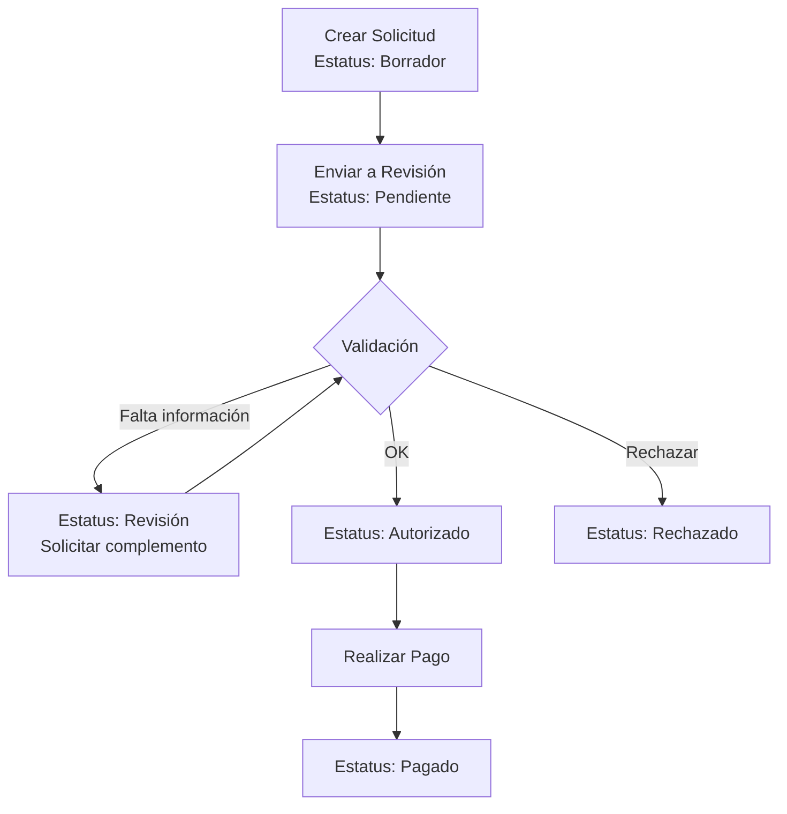

# 📋 Módulo de Trámite de Pago a Proveedores - SGRH

## 📌 Descripción General

Este módulo permite la gestión completa de proveedores y solicitudes de pago, facilitando el proceso de administración de pagos a proveedores de la organización.

---

## ✨ Características Principales

### 1. **Gestión de Proveedores**
- ✅ Catálogo completo de proveedores
- ✅ Datos fiscales (RFC, razón social)
- ✅ Información de contacto (teléfono, email)
- ✅ Datos bancarios (banco, cuenta, CLABE)
- ✅ Clasificación por tipo (bienes, servicios, construcción, arrendamiento)
- ✅ Categorización personalizada
- ✅ Control de estatus (activo/inactivo)

### 2. **Solicitudes de Pago**
- ✅ Generación automática de folios
- ✅ Registro de conceptos y montos
- ✅ Cálculo automático de totales (subtotal + IVA - retenciones)
- ✅ Referencias documentales (factura, contrato, orden de compra)
- ✅ Vinculación con unidades organizacionales
- ✅ Sistema de prioridades (baja, normal, alta, urgente)
- ✅ Gestión de estatus del trámite
- ✅ **Historial completo de cambios de estado**
- ✅ **Gestión de documentos adjuntos**

### 3. **Gestión de Documentos** 🆕
- 📄 **Factura** - Subir factura del proveedor
- 📝 **Solicitud de Pago a Tesorería** - Formato de solicitud
- 💳 **Comprobante de Pago** - Evidencia de pago realizado
- 📎 Otros documentos de soporte
- 🔒 Control de acceso por empresa
- 📥 Descarga de documentos
- 🗑️ Eliminación de documentos

### 4. **Historial de Cambios** 🆕
- 🕒 Registro automático de todos los cambios de estatus
- 👤 Identificación del usuario que realiza cada cambio
- 💬 Comentarios asociados a cada cambio
- 📅 Marca de tiempo precisa de cada movimiento
- 📊 Visualización cronológica tipo timeline

### 5. **Flujo de Trabajo**
Estados de solicitud:
- **Borrador**: Solicitud en construcción
- **Pendiente**: Solicitud enviada, en espera de revisión
- **Revisión**: En proceso de validación
- **Autorizado**: Aprobado para pago
- **Rechazado**: No aprobado
- **Pagado**: Pago realizado
- **Cancelado**: Solicitud cancelada

### 4. **Panel de Control**
- 📊 Dashboard con estadísticas
  - Proveedores activos
  - Pagos pendientes
  - Pagos autorizados
  - Monto pendiente de pago
- 🔍 Filtros avanzados de búsqueda
- 📑 Sistema de tabs para proveedores y pagos
- 📈 Visualización clara de prioridades y estados

---

## 📁 Estructura de Archivos

```
/sgrh
├── /public
│   ├── admin_pagos_proveedores.php      ⭐ NUEVO - Interfaz principal
│   ├── get_pago_documentos.php          ⭐ NUEVO - API documentos
│   ├── get_pago_historial.php           ⭐ NUEVO - API historial
│   └── download_documento.php           ⭐ NUEVO - Descarga documentos
│
├── /storage
│   └── /pagos_documentos                ⭐ NUEVO - Almacén de archivos
│
├── /migrations
│   └── 05_tramite_pago_proveedores.sql  ⭐ NUEVO - Estructura BD
│
├── /includes/layout
│   └── sidebar.php                       ✓ ACTUALIZADO - Menú nuevo módulo
│
└── /mds
    └── PAGOS_PROVEEDORES_README.md      📖 Este archivo
```

---

## 🗄️ Estructura de Base de Datos

### Tabla: `proveedores`
Catálogo de proveedores con información fiscal, contacto y bancaria.

**Campos principales:**
- `proveedor_id` - ID único
- `empresa_id` - Empresa asociada
- `razon_social` - Razón social (obligatorio)
- `rfc` - RFC (obligatorio)
- `nombre_comercial` - Nombre comercial
- `tipo_proveedor` - Tipo: bienes, servicios, construcción, arrendamiento, otro
- `categoria` - Categoría personalizada
- `banco`, `numero_cuenta`, `clabe` - Datos bancarios
- `estatus` - Activo/Inactivo

### Tabla: `pago_proveedores`
Solicitudes de pago a proveedores.

**Campos principales:**
- `pago_id` - ID único
- `empresa_id` - Empresa
- `proveedor_id` - Proveedor
- `folio` - Folio único autogenerado (PAG-YYYY-0001)
- `fecha_solicitud` - Fecha de solicitud
- `fecha_limite_pago` - Fecha límite
- `concepto` - Descripción del servicio/bien
- `subtotal`, `iva`, `retenciones`, `total` - Montos
- `numero_factura`, `numero_contrato` - Referencias
- `unidad_id` - Área solicitante
- `estatus` - Estado del trámite
- `prioridad` - Prioridad del pago

### Tabla: `pago_proveedores_documentos`
Almacena referencias a documentos adjuntos de cada solicitud de pago.

**Campos principales:**
- `documento_id` - ID único
- `pago_id` - Referencia a la solicitud de pago
- `nombre_archivo` - Nombre del archivo en servidor
- `nombre_original` - Nombre original del archivo
- `tipo_documento` - factura, solicitud_pago, comprobante_pago, orden_compra, contrato, otro
- `ruta_archivo` - Ruta relativa del archivo
- `mime_type` - Tipo MIME del archivo
- `tamaño_bytes` - Tamaño del archivo
- `descripcion` - Descripción opcional
- `uploaded_at` - Fecha de carga
- `uploaded_by` - Usuario que subió el archivo

**Tipos de documento permitidos:** PDF, JPG, JPEG, PNG, DOC, DOCX, XLS, XLSX

### Tabla: `pago_proveedores_historial`
Bitácora completa de cambios de estado de cada solicitud.

**Campos principales:**
- `historial_id` - ID único
- `pago_id` - Referencia a la solicitud
- `estatus_anterior` - Estatus previo al cambio
- `estatus_nuevo` - Nuevo estatus
- `comentario` - Comentario del cambio
- `created_at` - Fecha y hora del cambio
- `created_by` - Usuario que realizó el cambio

### Vista: `v_pagos_proveedores_resumen`
Resumen estadístico por proveedor.

---

## 🔐 Sistema de Permisos

El módulo utiliza un sistema granular de permisos:

| Permiso | Descripción | Acción |
|---------|-------------|--------|
| `pagos_proveedores.admin` | Administración completa | CRUD completo de proveedores y trámites |
| `pagos_proveedores.solicitar` | Crear solicitudes | Crear y consultar solicitudes propias |
| `pagos_proveedores.autorizar` | Autorizar pagos | Aprobar/rechazar solicitudes |
| `pagos_proveedores.pagar` | Registrar pagos | Marcar como pagado |
| `pagos_proveedores.ver` | Solo lectura | Consultar información |

### Asignación de Permisos

```sql
-- Asignar a rol Admin (ya incluido en migración)
INSERT IGNORE INTO rol_permisos (rol_id, permiso_id)
SELECT r.rol_id, p.permiso_id
FROM roles r
CROSS JOIN permisos p
WHERE r.nombre LIKE '%Admin%' 
  AND p.clave = 'pagos_proveedores.admin';

-- Asignar a Admin Organización
INSERT IGNORE INTO rol_permisos (rol_id, permiso_id)
SELECT r.rol_id, p.permiso_id
FROM roles r
CROSS JOIN permisos p
WHERE r.nombre LIKE '%Organizaci%n%' 
  AND p.clave IN ('pagos_proveedores.admin', 'pagos_proveedores.autorizar');
```

---

## 📝 Guía de Instalación

### Paso 1: Ejecutar Migración SQL

```bash
# Desde línea de comandos
mysql -u root -p nombre_base_datos < migrations/05_tramite_pago_proveedores.sql

# Desde phpMyAdmin
# Copiar y ejecutar el contenido de: migrations/05_tramite_pago_proveedores.sql
```

### Paso 2: Verificar Archivos

✅ Confirmar que existen:
- `public/admin_pagos_proveedores.php` - Interfaz principal
- `migrations/05_tramite_pago_proveedores.sql` - Script de BD
- `includes/layout/sidebar.php` - Actualizado con menú

### Paso 3: Verificar Permisos en BD

```sql
-- Verificar que los permisos existen
SELECT * FROM permisos WHERE clave LIKE 'pagos_proveedores%';

-- Verificar asignación a roles
SELECT r.nombre, p.clave
FROM rol_permisos rp
JOIN roles r ON r.rol_id = rp.rol_id
JOIN permisos p ON p.permiso_id = rp.permiso_id
WHERE p.clave LIKE 'pagos_proveedores%';
```

### Paso 4: Probar Acceso

1. Iniciar sesión con usuario Administrador
2. Ir a **Administración → Pagos a Proveedores**
3. El menú debe aparecer en el sidebar

---

## 🎯 Uso del Sistema

### A. Registrar un Proveedor

1. Ir a **Administración → Pagos a Proveedores**
2. Tab **"Proveedores"**
3. Clic en **"Nuevo proveedor"**
4. Llenar datos obligatorios:
   - Razón Social
   - RFC
   - Tipo de proveedor
5. Opcional: datos de contacto y bancarios
6. Guardar

### B. Crear Solicitud de Pago

1. Tab **"Solicitudes de Pago"**
2. Clic en **"Nueva solicitud de pago"**
3. Llenar formulario:
   - Seleccionar proveedor
   - Fecha de solicitud
   - Concepto del pago
   - Subtotal (el IVA y total se calculan automáticamente)
   - Referencias (factura, contrato)
   - Unidad solicitante
   - Prioridad y estatus inicial
4. Guardar

**Nota:** El sistema genera automáticamente un folio único: `PAG-2026-0001`

### C. Cambiar Estatus de Solicitud

1. En la tabla de solicitudes
2. Clic en el botón de estatus (icono de cambio)
3. Seleccionar nuevo estatus:
   - Pendiente → Revisión
   - Revisión → Autorizado / Rechazado
   - Autorizado → Pagado
4. Agregar comentario (opcional)
5. Confirmar

**Nota:** Todos los cambios quedan registrados en el historial automáticamente.

### D. Gestionar Documentos 🆕

1. En la tabla de solicitudes, clic en el botón de documentos (📄)
2. **Subir nuevo documento:**
   - Seleccionar tipo de documento:
     - 📄 **Factura**
     - 📝 **Solicitud de Pago a Tesorería**
     - 💳 **Comprobante de Pago**
     - Otros tipos disponibles
   - Elegir archivo (PDF, JPG, PNG, DOC, XLS)
   - Agregar descripción opcional
   - Clic en "Subir Documento"
3. **Ver documentos adjuntos:**
   - Lista de todos los documentos del pago
   - Descargar cualquier documento
   - Eliminar documentos (con confirmación)

**Archivos permitidos:** PDF, JPG, JPEG, PNG, DOC, DOCX, XLS, XLSX (máximo 10MB)

### E. Ver Historial de Cambios 🆕

1. En la tabla de solicitudes, clic en el botón de historial (⏱️)
2. Se muestra en formato timeline:
   - Cada cambio de estatus
   - Fecha y hora exacta
   - Usuario que realizó el cambio
   - Comentarios asociados
   - Estado anterior y nuevo estado

### F. Consultar y Filtrar

**Proveedores:**
- Buscar por razón social, RFC, nombre comercial
- Filtrar por tipo de proveedor
- Filtrar por estatus

**Pagos:**
- Buscar por folio, concepto, proveedor
- Filtrar por estatus
- Filtrar por prioridad

---

## 📊 Flujo de Trabajo Recomendado



---

## 🎨 Interfaz de Usuario

### Dashboard Principal
- **4 Tarjetas de estadísticas:**
  1. Proveedores activos
  2. Pagos pendientes
  3. Pagos autorizados
  4. Monto pendiente

### Tab de Proveedores
- Tabla con información clave
- Filtros de búsqueda
- Botones de acción (editar, activar/inactivar)
- Modal para alta/edición

### Tab de Solicitudes de Pago
- Tabla con folios, fechas, montos
- Badges de color por:
  - **Estatus** (borrador, pendiente, revisión, etc.)
  - **Prioridad** (baja, normal, alta, urgente)
- Botones para cambiar estatus y ver detalles

---

## 🔧 Personalización

### Agregar Nuevos Tipos de Proveedor

Editar tabla `proveedores`, campo `tipo_proveedor`:

```sql
ALTER TABLE proveedores 
MODIFY tipo_proveedor ENUM('bienes', 'servicios', 'construccion', 'arrendamiento', 'consultoria', 'otro') DEFAULT 'servicios';
```

### Agregar Nuevos Estados de Pago

Editar tabla `pago_proveedores`, campo `estatus`:

```sql
ALTER TABLE pago_proveedores 
MODIFY estatus ENUM('borrador', 'pendiente', 'revision', 'autorizado', 'rechazado', 'en_pago', 'pagado', 'cancelado') DEFAULT 'borrador';
```

---

## 🐛 Resolución de Problemas

### El menú no aparece

**Solución:**
```sql
-- Verificar permisos del usuario
SELECT p.clave, p.descripcion
FROM rol_permisos rp
JOIN permisos p ON p.permiso_id = rp.permiso_id
JOIN usuario_roles ur ON ur.rol_id = rp.rol_id
WHERE ur.usuario_id = TU_USUARIO_ID;
```

### Error al crear proveedor con RFC duplicado

**Causa:** Constraint de unicidad `uk_empresa_rfc`

**Solución:** Cada empresa puede tener un proveedor con el mismo RFC solo una vez. Verificar si ya existe:

```sql
SELECT * FROM proveedores 
WHERE empresa_id = 1 AND rfc = 'TYS980101ABC';
```

### Folio no se genera automáticamente

**Solución:** Verificar permisos de INSERT en la tabla. El folio se genera en el servidor:

```php
$year = date('Y');
// Cuenta registros del año actual
$folio = 'PAG-' . $year . '-' . str_pad($count + 1, 4, '0', STR_PAD_LEFT);
```

---

## 📈 Mejoras Futuras (Roadmap)

### Implementadas ✅
- [x] **Carga de documentos adjuntos** (facturas PDF, imágenes, documentos Office)
- [x] **Historial completo de cambios** con usuario, fecha y comentarios
- [x] **Gestión de 3 documentos principales**: Factura, Solicitud de Pago, Comprobante

### Por Implementar 📋
- [ ] **Notificaciones por email** en cambios de estatus
- [ ] **Reportes PDF** de solicitudes
- [ ] **Dashboard gráfico** con charts
- [ ] **API REST** para integración con sistemas externos
- [ ] **Programación de pagos recurrentes**
- [ ] **Firma electrónica** de autorizaciones
- [ ] **Integración bancaria** para pagos automáticos
- [ ] **Multi-moneda** (USD, EUR)
- [ ] **Orden de compra automática**
- [ ] **Generación automática** de solicitud de pago en PDF
- [ ] **OCR** para lectura automática de facturas PDF
- [ ] **Validación de XML** de facturas electrónicas SAT

---

## 📞 Soporte

Para dudas o problemas con el módulo:

1. Revisar esta documentación
2. Verificar logs de errores en PHP
3. Consultar bitácora de cambios en tabla `bitacora`

```sql
-- Ver últimas acciones del módulo
SELECT * FROM bitacora 
WHERE modulo = 'pagos_proveedores' 
ORDER BY created_at DESC 
LIMIT 50;
```

---

## 📜 Historial de Versiones

### v1.0 (2026-02-11)
- ✅ Gestión de proveedores (CRUD completo)
- ✅ Solicitudes de pago (CRUD completo)
- ✅ Sistema de permisos granular
- ✅ Dashboard con estadísticas
- ✅ Filtros avanzados
- ✅ Historial de cambios de estado
- ✅ Cálculo automático de totales
- ✅ Folios autogenerados

---

## 🏁 Conclusión

El **Módulo de Trámite de Pago a Proveedores** proporciona una solución completa para:
- Centralizar información de proveedores
- Gestionar solicitudes de pago de forma ordenada
- Dar seguimiento al flujo de autorización
- Mantener trazabilidad de los pagos
- Generar reportes y estadísticas

**¡El módulo está listo para usar!** 🎉

---

**Documentación generada:** 11 de febrero de 2026  
**Versión del módulo:** 1.0  
**Sistema:** SGRH - Sistema de Gestión de Recursos Humanos
